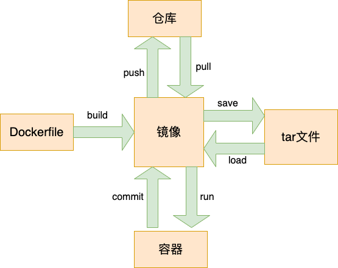

## 前沿

今天我们来聊聊`docker`，这个已经🔥火的不能在火的产品了。


## Docker的由来

我们知道一款产品从开发到上线，从操作系统，到运行环境，再到应用配置。作为开发+运维之间的协作我们需要关心很多东西，这也是很多互联网公司都不得不面对的问题，特别是各种版本的迭代之后，不同版本环境的兼容，对运维人员都是考验。

就在这里明星`Docker` 诞生了 **软件可以带环境安装** 也就是说，安装的时候，把原始环境一模一样地复制过来。开发人员利用`Docker` 可以消除 协作 编码时“**在我的机器上可以正常工作**”的问题


## 使用

我们如果不想安装的话，可以直接使用`docker `在线的学习机器 地址 `https://labs.play-with-docker.com/`   登入下就可以直接使用啦。

我们来看一张图



这是一张 简单的`docker` 架构图

- 首先我们从远程仓库来 拉取镜像。这里以`nginx` 为例

```
$ docker pull nginx
```

- 接着我们将容器运行起来

```
//我们可以先查看下镜像
$ docker images
//接着我们启动容器
$ docker run --name mynginx -d -p80:80 nginx 
//查看容器使用情况
$ docker ps
//进入容器内部
$ docker exec -it 容器ID bash
//强制删除容器
$ docker rm -f 容器ID
```

`--name` 指定容器名称

`-d` 后台运行容器

`-p` 指定端口，主机端口号:容器端口号

`-v` 目录映射：-v 'dir name' : <dir>


## 构建镜像

我们有两种方式来构建镜像

一、使用 `docker commit`

```
// 构建镜像
$ docker commit 容器ID m1
// 查看镜像
$ docker images
// 启动容器
$ docker run --name mym1 -d -p81:80 m1 
```

二、 使用 `Dockerfile`

```
// vim创建一个 Dockerfile 文件里面就写一句话 FROM nginx 然后保存退出
// 然后执行
$ docker build -t m2 .
// 查看镜像
$ docker images
// 启动容器
$ docker run --name mym2 -d -p82:80 m2 
```


## 导出镜像

我们可以将镜像导出来给同伴来使用

```
//将容器m2 打包成 tar文件
$ docker save m2 > 1.tar
//然后可以查看文件是否存在
$ ls
1.tar 
```

然后同伴拿到 `tar` 文件可以执行

```
$ docker load < 1.tar 
```

来得到 镜像


## 致谢

感谢你看完这篇文章，有什么不对的地方欢迎指出，谢谢🙏