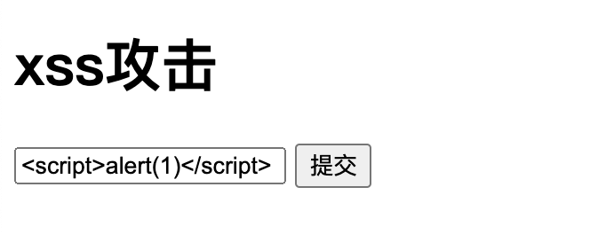
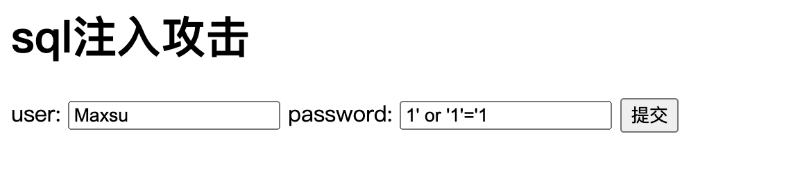

## 前沿

今天我们来讨论讨论web安全方面的知识，比如我们熟知的XSS攻击，和SQL注入。接下来我们以PHP语言来演示这两个漏洞。

## XSS攻击

**定义**：什么是==XSS. Cross-Site Scripting==（跨站脚本攻击）简称==XSS==，是一种代码注入攻击。 攻击者通过在目标网站上注入恶意脚本，使之在用户的浏览器上运行。 利用这些恶意脚本，攻击者可获取用户的敏感信息如Cookie、SessionID 等，进而危害数据安全。

**演示**

[github仓库地址](https://github.com/H-pinke/WebSecurity)

这样提交之后会有什么后果呢？

会弹出一个提示框内容为1

那如果加了一个while 循环呢？程序就死在这里了

所以面对XSS攻击我们要对网页内容进行过滤

**解决方案** 

- 在网页内容输出的时候做转译，将<>转译为`<` 和 `>`

- php中通过`htmlspecialchars`函数简单搞定

    

## SQL注入

**定义**：

​	SQL注入即是指**web应用程序**对用户输入数据的合法性没有判断或过滤不严，攻击者可以在web应用程序中事先定义好的查询语句的结尾上添加额外的**SQL语句**，在管理员不知情的情况下实现非法操作，以此来实现欺骗**数据库服务器**执行非授权的任意查询，从而进一步得到相应的数据信息

**演示：**

这里以sqlite3来演示

这样提交之后会有什么后果呢？

我们来看看生成的sql样子

`SELECT * from USER where NAME = 'Maxsu' and PASSWORD = '1' or '1'='1'`

所以这条语句永远会执行成功的

因为 `or '1'='1'` 永远为真

**解决方案：**

​	不相信用户的输入，sql预编译或者转义字符。

## 致谢

大家可以自己动手感受下，演示代码地址 `https://github.com/H-pinke/WebSecurity`

感谢你看完这篇文章，有什么不对的地方欢迎指出，谢谢🙏

