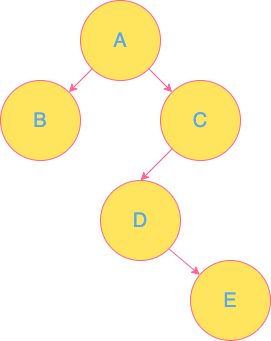

## 前沿

前几期文章我介绍了链表，队列，栈这些都是线性结构的存储方式。今天我们来看看非线性结构的树


## 定义

专业的定义：

- 有且只有一个称为根的节点
- 有若干个互不相交的子树，这些子树本身也是一颗树

通俗的定义：

- 树是由节点和边组成
- 每个节点只有一个父节点但可以有多个子节点
- 但有一个节点例外，该节点没有父节点，此节点称为根节点

专业术语：

- 深度：从根节点到最底层节点的层数称之为深度（根节点是第一层）
- 叶子节点：没有子节点的节点
- 非终端节点：实际就是非叶子节点（根节点既可以是叶子也可以是非叶子节点）
- 度：子节点的个数称为度（一棵树看最大的）

## 分类

树的分类

- 一般树

    任意一个节点的子节点的个数都不受限制，子节点的顺序可以更改也可以不能更改，能更改的树为无序一般树，不能更改的为有序一般树

- 二叉树

    任意一个节点的子节点个数最多两个，且子节点的位置不可更改，即左子树和右子树的位置不可更改。

    分类：

    1. 一般二叉树

    2. 满二叉树：

        在不增加树的层数的前提下，无法再多添加一个节点的二叉树就是满二叉树

    3. 完全二叉树：

        如果只是删除了满二叉树最底层最右边的连续若干个节点，这样形成的二叉树就是完全二叉树。

    

    存储：

    - 连续存储：

        连续存储用数组存储【适用于完全二叉树，不是完全二叉树的树补充为完全二叉树】

        **优点** ： 查找某个节点的父节点和子节点（也包括判断有没有子节点）方便快捷

        **缺点**： 消耗内存空间过大

    - 链式存储：

        链式存储两个指针域分别指向两个子节点，没有子节点的为空

        **优点**：耗用内存空间小

        **缺点**：查找父节点不方便


## 算法

我们来看看经典的二叉树的前中后序遍历




###### 一、首先来看看先序遍历

- 先访问根节点
- 再先序访问左子树
- 再先序访问右子树

```
//先序遍历伪代码
void PreTraverseBTree(PBTNODE pT)
{
    if (pT != NULL) {
        printf("%c\n", pT->data);
        PreTraverseBTree(pT->pLchild);
        PreTraverseBTree(pT->pRchild);
    }
}
```

先序遍历结果 `A B C D E`

###### 二、再来看看中序遍历

- 中序遍历左子树
- 再访问根节点
- 再中序遍历右子树

```
//中序遍历伪代码
void MidTraverseBTree(PBTNODE pT)
{
    if (pT != NULL) {       
        MidTraverseBTree(pT->pLchild); 
        printf("%c\n", pT->data);
        MidTraverseBTree(pT->pRchild);     
    }
}
```

中序遍历结果 `B A D E C`

###### 三、最后是后序遍历

- 先后序遍历左子树
- 再后序遍历右子树
- 再访问根节点

```
//后序遍历伪代码
void LastTraverseBTree(PBTNODE pT)
{
    if (pT != NULL) {
       
        LastTraverseBTree(pT->pLchild);
        LastTraverseBTree(pT->pRchild);
        printf("%c\n", pT->data);
    }
}
```

后序遍历结果 `B E D C A`


## 致谢

感谢你看完这篇文章，有什么不对的地方欢迎指出，谢谢🙏


