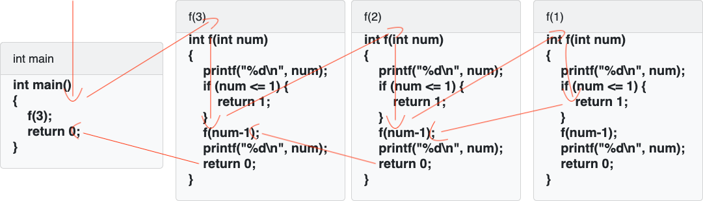

## 前沿

递归的思想是软件思想的基本思想之一，在树和图上面，几乎全是用递归来实现的。计算机特别适合用递归的思想来解决问题，但是我们人类用递归的思想来考虑问题就会感到十分困扰。接下来我们一起探究递归吧。


## 定义

一个函数自己直接或者间接调用自己

**注**：一个函数调用另外一个函数和他调用自己都是一模一样的。

递归满足的三个条件：

- 递归必须有一个明确的终止条件
- 该函数处理的数据规模必须在递减
- 这个转化必须时可解的


## 函数的调用

​	**当在一个函数的运行期间调用另外一个函数时，在运行被调用函数之前，系统需要完成三件事**

- 将所有的实际参数，返回地址等信息传递给被调用函数。
- 为被调用函数的局部变量（也包括形参）分配存储空间。
- 将控制转移到被调用函数的入口。

**从被调函数返回主调函数之前，系统也要完成三件事**

- 保存被调函数的返回结果
- 释放被调函数所占的存储空间
- 依照被调函数保存的返回地址将控制转移到调用函数

==当有多个函数相互调用时，按照“后调用先返回”的原则==

==上诉函数之间信息传递和控制转移必须借助 “栈” 来实现，即系统将整个程序运行所需的数据空间安排在一个栈中，每当调用一个函数时，将在栈顶分配一个存储区，进行压栈操作，每当一个函数退出时，就释放它的存储区，就进行出栈操作，当前运行的函数永远都在栈顶位置。==


## 算法

我们来看一题比较经典的面试题，大家可以自己猜测下运算结果

```
#include <iostream>
#include <cstdlib>
int f(int num)
{
    printf("%d\n", num);
    if (num <= 1) {
        return 1;
    }
    f(num-1);
    printf("%d\n", num);
    return 0;
}
int main() 
{
    f(3);
    return 0;
}
```

这道题目结果会是什么呢？他究竟是怎么调用的呢？

我来画个调用图



我们关注红色的调用箭头

- 首先运行主函数的f(3)
- 然后调用 int f(3) 打印出 3
- 然后调用 int f(2) 打印出 2
- 然后调用 int f(1) 打印出 1，然后满足条件 return 1；结束 int (f1)
- 之后回到 int f(2) 打印出 2
- 之后回到 int f(3) 打印出 3
- 最后回到主函数，程序结束

所以最后打印的数是 `3 2 1 2 3`


## 致谢

感谢你看完这篇文章，有什么不对的地方欢迎指出，谢谢🙏

