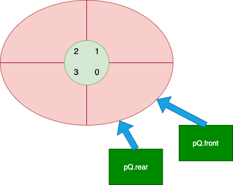
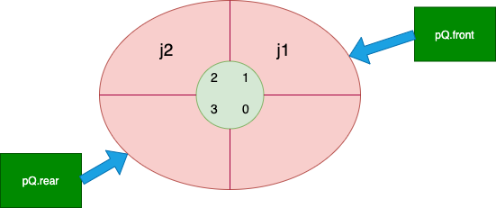
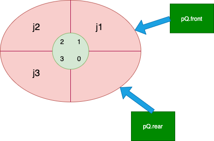

## 前沿

队列广泛应用在各种软件系统中，所以这块的知识点我们也要好好掌握起来。

## 定义

和栈相反，**队列**是一种**先进先出**的线性表。

它只允许在表的一端进行插入，而在另一端进行删除元素。

允许插入的一端叫做**队尾**，允许删除的一端则称为**队头**。

## 分类

- 链式队列：用链表实现
- 静态队列：用数组实现

## 算法

我们这里以**静态队列**来实现

首先静态队列都必须是**循环队列**，这样可以减少内存浪费。

1. 初始化队列

    

我们看到了 front 和rear这个两个关键参数，它们在不同的位置上的含义分别是：

- 队列初始化

    front和rear的值都为0

- 队列非空

    front 代表队列的第一个元素

    rear 代表队列的最后一个有效元素的下一个元素

- 队列空

    front和rear值相等，但是不一定为零。

    

接着我们来看看初始化伪代码

```
typedef struct Queue
{
	int * pBase;
	int front;
	int rear;
} QUEUE; 
void init(QUEUE *pQ)
{
	pQ->pBase = (int *)malloc(sizeof(int) * 4);
	pQ->front = 0;
	pQ->rear = 0;
}
```

front和rear的值都赋为0，完成初始化。


2. 循环队列出队和入队

    

    

**入队伪算法**

```
bool en_queue(QUEUE * pQ, int val)
{
		pQ->pBase[pQ->rear] = val;
		pQ->rear = (pQ->rear+1) % 4;
		return true;
}
```

入队分两步骤完成

- 将值存入rear 所代表的位置
- 将rear后移，由于是循环队列 所有要 `rear = (rear+1)%数组长度`


**出队伪算法**

```
bool out_queue(QUEUE * pQ, int * pVal)
{
		*pVal = pQ->pBase[pQ->front];
		pQ->front = (pQ->front+1) % 4;
}
```

出队也是两步骤

- 先将值出队的值保存起来
- 然后front后移。由于是循环队列 所有要 `front = (front+1)%数组长度`


3.  如何判断循环队列已满



伪代码

```
bool full_queue(QUEUE * pQ)
{
	if ((pQ->rear + 1) % 4 == pQ->front)
		return true;
	else
		return false;
}
```

如果rear 和 front紧挨着，则队列已满

通常表示就是 `if((rear+1)%数组长度 == front)`

当然也还有别的方式，比如增加一个标示参数记录元素的个数。


## 致谢

感谢你看完这篇文章，有什么不对的地方欢迎指出，谢谢🙏